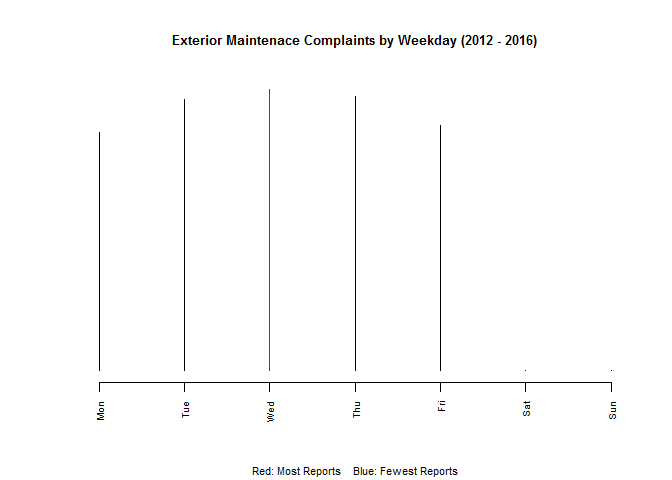
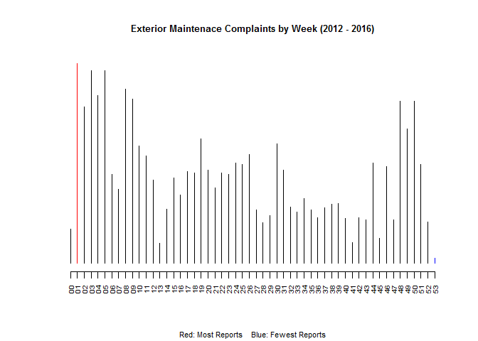
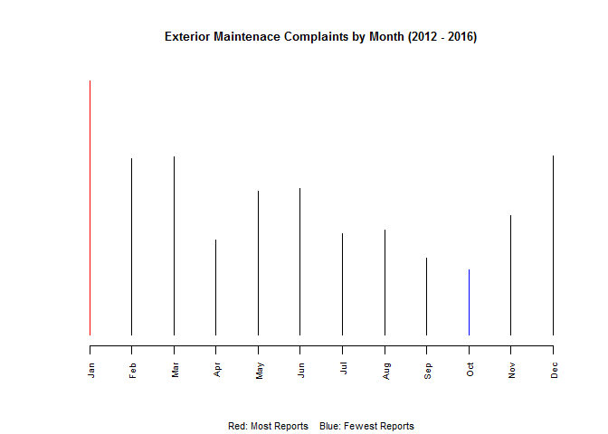
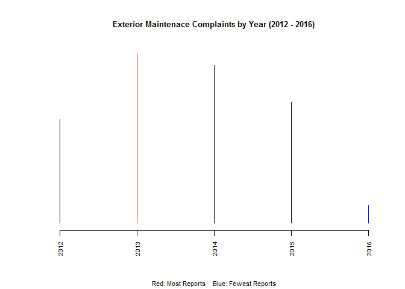
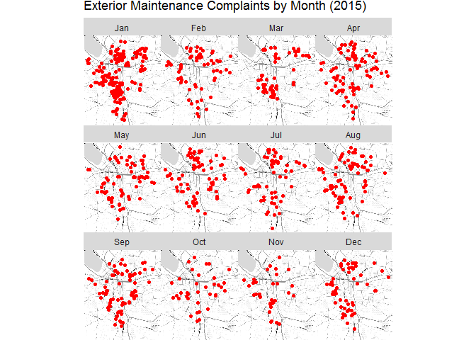

Lab01
================
Christine Brown
February 2, 2017

### Load packages

``` r
library( dplyr )
library( ggmap )
```

### Data Preparation

``` r
#Access Data
data.url <- "https://raw.githubusercontent.com/lecy/code-orange/master/data/code%20violations.csv"
dat <- read.csv( data.url , stringsAsFactors = F )
dat <- dat[ , c( "Complaint.Type" , "Violation.Date" , "lat" , "lon" ) ]

#Change Violation Date Data Type
dat$Violation.Date <- as.Date( dat$Violation.Date , format = "%m/%d/%Y" )

#Add New Date Columns to Dataframe
dat <- mutate( dat,
        Weekday = format(dat$Violation.Date , format = "%a" ) ,
        Week = format(dat$Violation.Date , format = "%W" ) ,
        Month = format(dat$Violation.Date , format = "%b" ) ,
        Year = format(dat$Violation.Date , format = "%Y" ) )

#Look at the Number of Complaints to Determine Which Category to Explore
sort( table( dat$Complaint.Type ) , decreasing = TRUE )
```

    ## 
    ##  Property Maintenance-Int  Property Maintenance-Ext 
    ##                     26419                      9135 
    ## Trash/Debris-Private, Occ  Overgrowth: Private, Occ 
    ##                      3325                      3003 
    ## Complaint Reqst - General     Illegal Trash Set Out 
    ##                      2470                      1893 
    ##               Fire Safety                  Bed Bugs 
    ##                       849                       830 
    ##               Infestation       Building W/O Permit 
    ##                       720                       478 
    ##  Cert of Use - Restaurant  Cert of Use - Food Store 
    ##                       411                       407 
    ##         Unsafe Conditions         Cert of Use - Bar 
    ##                       265                       194 
    ##                Fire Alarm                Demolition 
    ##                       161                       137 
    ##         Zoning Violations               Other (FPB) 
    ##                       110                        78 
    ##          Sprinkler System     Vacant Lot: Overgrown 
    ##                        78                        59 
    ##      Blocked/Locked Exits          Faulty Equipment 
    ##                        56                        51 
    ##                   Heating Suppression-not sprinkler 
    ##                        38                        36 
    ## Graffiti: PrivateProperty         Structural Issues 
    ##                        31                        29 
    ##             Sewer Back Up Water Shop:All Complaints 
    ##                        21                        21 
    ##    Tenant Safety Concerns Vacant House Open toEntry 
    ##                        17                        15 
    ##  Over Capacity (Assembly) OverCapacity/too many ppl 
    ##                        10                         9 
    ## CleanUp Rqst: Public Prop  Sanitation/Special Reqst 
    ##                         8                         8 
    ##         Electrical Hazard        No Smoke Detectors 
    ##                         7                         5 
    ##  Cert of Use - Drug Store  Construction Site Safety 
    ##                         4                         4 
    ## Outdoor / Illegal Burning    Overgrown Veg - Public 
    ##                         4                         4 
    ## Vacant: Illegal Occupancy                Yard Waste 
    ##                         3                         3 
    ## Const/Demo Debris: Req PU          Improper storage 
    ##                         2                         2 
    ##                  Lock Box Medical Waste-P/U Refused 
    ##                         2                         2 
    ## Preventative Code Enforce  Vacant Lot: Trash/Debris 
    ##                         2                         2 
    ##   Vacant Structure Hazard  Blue Bin: request new BB 
    ##                         2                         1 
    ##      Bulk Household Items Corners Need Snow Removal 
    ##                         1                         1 
    ## Graffiti: Public Property      Repair Creek Fencing 
    ##                         1                         1 
    ##  Tree Inspect/Problem Req   Tree/Limb/Stump Removal 
    ##                         1                         1

``` r
#Create A Subset of the Dataframe containing only Exterior Property Maintenance Complaints for Years with Adequate Data
dat.exmaint <- dat[ dat$Complaint.Type == "Property Maintenance-Ext" , ]
dat.exmaint <- dat.exmaint[ dat.exmaint$Year > 2011 , ]

#Order New Date Columns
days.in.order <- c( "Mon" , "Tue" , "Wed" , "Thu" , "Fri" , "Sat" , "Sun" )
dat.exmaint$Weekday <- factor( dat.exmaint$Weekday , ordered = TRUE , levels = days.in.order )
months.in.order <- c( "Jan" , "Feb" , "Mar" , "Apr" , "May" , "Jun" , "Jul" , "Aug" , "Sep" , "Oct" , "Nov" , "Dec" )
dat.exmaint$Month <- factor( dat.exmaint$Month , ordered = TRUE , levels = months.in.order )
```

### Plots

#### *- Plots Based on Different Levels of Date Aggregation -*

``` r
wd.tbl <- table( dat.exmaint$Weekday )
wd.max <- days.in.order[ which.max( wd.tbl ) ]
wd.min <- days.in.order[ which.min( wd.tbl ) ]
wd.col <- ifelse( wd.tbl == wd.tbl[ wd.max ], "red", 
                  ifelse( wd.tbl == wd.tbl[ wd.min ], "blue", "black" ) )
plot( wd.tbl , 
      lwd = 1 , 
      las = 2 ,
      cex.axis = .6 ,
      ylab = "" ,
      bty = "n" ,
      yaxt = "n" ,
      cex.main = .8 ,
      col = wd.col ,
      main = "Exterior Maintenace Complaints by Weekday (2012 - 2016)",
      sub = "Red: Most Reports    Blue: Fewest Reports",
      cex.sub = .7)
```



``` r
w.tbl <- table( dat.exmaint$Week )
w.max <- which.max( w.tbl )
w.min <- which.min( w.tbl )
w.col <- ifelse( w.tbl == w.tbl[ w.max ], "red", 
                 ifelse( w.tbl == w.tbl[ w.min ], "blue", "black" ) )
plot( w.tbl,
      lwd = 1 , 
      las = 2 ,
      cex.axis = .6 ,
      ylab = "" ,
      bty = "n" ,
      yaxt = "n" ,
      cex.main = .8 ,
      col = w.col,
      main ="Exterior Maintenace Complaints by Week (2012 - 2016)",
      sub = "Red: Most Reports    Blue: Fewest Reports",
      cex.sub = .7 )
```



``` r
m.tbl <- table( dat.exmaint$Month )
m.max <- months.in.order[ which.max( m.tbl ) ]
m.min <- months.in.order[ which.min( m.tbl ) ]
m.col <- ifelse( m.tbl == m.tbl[ m.max ], "red", 
                 ifelse( m.tbl == m.tbl[ m.min ], "blue", "black" ) )
plot( m.tbl,
      lwd = 1 , 
      las = 2 ,
      cex.axis = .6 ,
      ylab = "" ,
      bty = "n" ,
      yaxt = "n" ,
      cex.main = .8 ,
      col = m.col,
      main = "Exterior Maintenace Complaints by Month (2012 - 2016)",
      sub = "Red: Most Reports    Blue: Fewest Reports",
      cex.sub = .7 )
```



``` r
y.tbl <- table( dat.exmaint$Year )
y.max <- which.max( y.tbl )
y.min <- which.min( y.tbl )
y.col <- ifelse( y.tbl == y.tbl[ y.max ], "red", 
                ifelse( y.tbl == y.tbl[ y.min ], "blue", "black" ) )
plot( y.tbl,
      lwd = 1 , 
      las = 2 ,
      cex.axis = .6 ,
      ylab = "" ,
      bty = "n" ,
      yaxt = "n" ,
      cex.main = .8 ,
      col = y.col,
      main = "Exterior Maintenace Complaints by Year (2012 - 2016)",
      sub = "Red: Most Reports    Blue: Fewest Reports",
      cex.sub = .7 )
```



#### *- Plots for Each Month in 2015 -*

``` r
#Create a Subset of Data for the Year 2015

dat.exmaint.2015 <- dat.exmaint[dat.exmaint$Year == 2015, ]


#Create a Bounding Box for the Maps

location <- geocode( "syracuse" )
lon.max <- location$lon + .08
lon.min <- location$lon - .08
lat.max <- location$lat + .08
lat.min <- location$lat - .08
dat.exmaint.2015 <- dat.exmaint.2015[ dat.exmaint.2015$lat > lat.min &
                                      dat.exmaint.2015$lat < lat.max , ]
dat.exmaint.2015 <- dat.exmaint.2015[ dat.exmaint.2015$lon > lon.min &
                                      dat.exmaint.2015$lon < lon.max , ]


#Plot the Data for 2015 by Month

qmplot( lon, lat, data = dat.exmaint.2015 ,
        maptype = "toner-lite" ,
        color = I( "red" ) , main = "Exterior Maintenance Complaints by Month (2015)") +
        facet_wrap( ~ Month ) +
        theme( legend.position = "none" )
```


