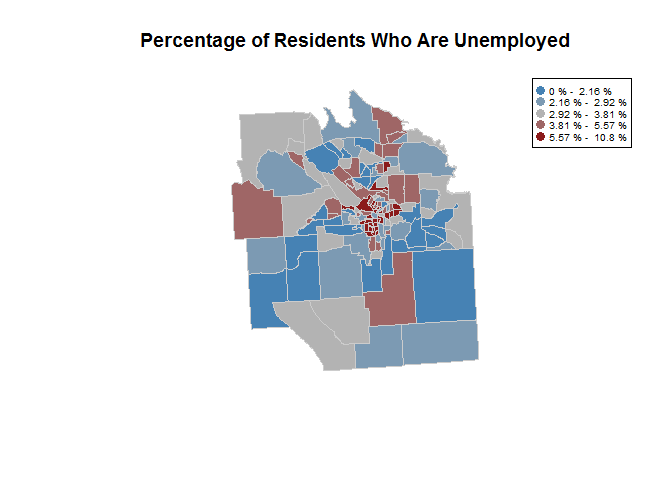
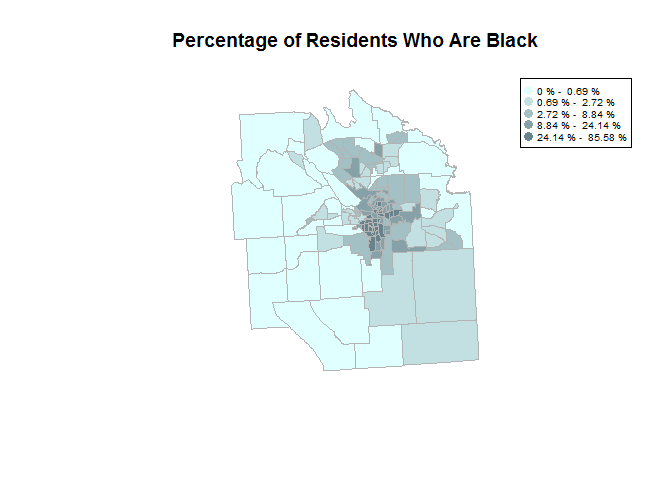
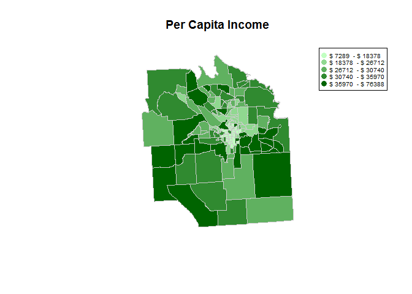

Lab03
================
Christine Brown
February 16, 2017

``` r
#Set Working Directory
setwd("C:/Users/brown/Documents/Grad School/Fall 16/DDMII/all-labs-ddmii-christine-brown/Lab03")

#Load Packages
library(devtools)
devtools::install_github("hrecht/censusapi")
censuskey <- "5a1a01fa6496e71097aa2d4a066bed72117c8069"
library(censusapi)
library(dplyr)
library( maptools )
library( sp )

#Load Data
download.file("ftp://ftp2.census.gov/geo/tiger/TIGER2010/TRACT/2010/tl_2010_36067_tract10.zip", "onondaga census tracts.zip" )
unzip( "onondaga census tracts.zip" )
file.remove( "onondaga census tracts.zip" )
```

    ## [1] TRUE

``` r
syr <- readShapePoly( fn="tl_2010_36067_tract10", 
                      proj4string=CRS("+proj=longlat +datum=WGS84") )
dat <- getCensus(name="acs5", vintage=2015, key=censuskey,
                 vars=c( "B01001_001E" , "B01001B_001E" , "B23025_005E" , "B19301_001E" ) ,
                 region="tract:*" , regionin="state:36+county:067")

#Rename Census Columns
dat <- rename(dat, Population = B01001_001E )
dat <- rename(dat, Black=B01001B_001E )
dat <- rename(dat, Unemployed=B23025_005E )
dat <- rename(dat, PerCapitaIncome=B19301_001E )

#Create Columns Showing Percentage of Population Unemployed and Black
dat <- mutate( dat , PerUnemployed = dat$Unemployed / dat$Population , PerBlack = dat$Black / dat$Population)

#Create Color Functions
this.order <- match(syr$TRACTCE10,dat$tract) #match census data with spatial data

color.function.unemp <- colorRampPalette( c("steel blue","gray70", "firebrick4" ) ) #set gradient colors
col.ramp.unemp <- color.function.unemp( 5 ) # create gradient with 5 colors
color.unemp <- cut( rank(dat$PerUnemployed), breaks=5, labels=col.ramp.unemp ) #vector applies gradient to position based on percent unemployment
color.unemp <- as.character( color.unemp ) #make it a character
color.unemp.ordered <- color.unemp[this.order] #order the color vector

color.function.black <- colorRampPalette( c("lightcyan", "lightblue4" ) )
col.ramp.black <- color.function.black( 5 )
color.black <- cut( rank(dat$PerBlack), breaks=5, labels=col.ramp.black )
color.black <- as.character( color.black )
color.black.ordered <- color.black[this.order]


color.function.pci <- colorRampPalette( c("darkseagreen1", "darkgreen" ) )
col.ramp.pci <- color.function.pci( 5 )
color.pci <- cut( rank(dat$PerCapitaIncome), breaks=5, labels=col.ramp.pci )
color.pci <- as.character( color.pci )
color.pci.ordered <- color.pci[this.order]

#Plot Maps
plot( syr,  border="gray80", col=color.unemp.ordered, main="Percentage of Residents Who Are Unemployed" )
brk.unem <- quantile(dat$PerUnemployed,probs = c(0, .2, .4, .6, .8, 1))
legend('topright', col=col.ramp.unemp, pch=19, pt.cex=1.2, cex=0.6, 
       legend = c( paste( round( brk.unem[1]*100, 2 ), "% - ", round( brk.unem[2]*100, 2 ), "%"),
                   paste( round( brk.unem[2]*100, 2 ), "% - ", round( brk.unem[3]*100, 2 ), "%"),
                   paste( round( brk.unem[3]*100, 2 ), "% - ", round( brk.unem[4]*100, 2 ), "%"),
                   paste( round( brk.unem[4]*100, 2 ), "% - ", round( brk.unem[5]*100, 2 ), "%"),
                   paste( round( brk.unem[5]*100, 2 ), "% - ", round( brk.unem[6]*100, 2 ), "%")))
```



``` r
plot( syr,  border="gray70", col=color.black.ordered, main="Percentage of Residents Who Are Black" )
brk.blk <- quantile(dat$PerBlack,probs = c(0, .2, .4, .6, .8, 1))
legend('topright', col=col.ramp.black, pch=19, pt.cex=1.2, cex=0.6,
       legend = c( paste( round( brk.blk[1]*100, 2 ), "% - ", round( brk.blk[2]*100, 2 ), "%"),
                   paste( round( brk.blk[2]*100, 2 ), "% - ", round( brk.blk[3]*100, 2 ), "%"),
                   paste( round( brk.blk[3]*100, 2 ), "% - ", round( brk.blk[4]*100, 2 ), "%"),
                   paste( round( brk.blk[4]*100, 2 ), "% - ", round( brk.blk[5]*100, 2 ), "%"),
                   paste( round( brk.blk[5]*100, 2 ), "% - ", round( brk.blk[6]*100, 2 ), "%")))
```



``` r
plot( syr,  border="gray80", col=color.pci.ordered, main="Per Capita Income" )
brk.pci <- quantile(dat$PerCapitaIncome,probs = c(0, .2, .4, .6, .8, 1))
legend('topright',col=col.ramp.pci, pch=19, pt.cex=1.2, cex=0.6,
       legend = c( paste( "$", round( brk.pci[1], 0 ), " - $", round( brk.pci[2], 0 )),
                   paste( "$", round( brk.pci[2], 0 ), " - $", round( brk.pci[3], 0 )),
                   paste( "$", round( brk.pci[3], 0 ), " - $", round( brk.pci[4], 0 )),
                   paste( "$", round( brk.pci[4], 0 ), " - $", round( brk.pci[5], 0 )),
                   paste( "$", round( brk.pci[5], 0 ), " - $", round( brk.pci[6], 0 ))))
```


