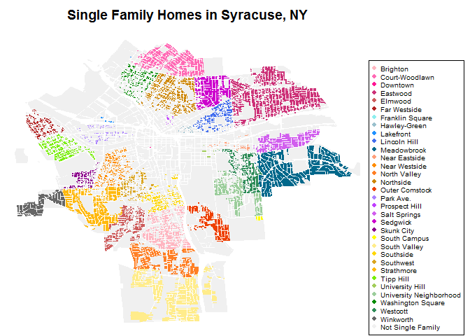
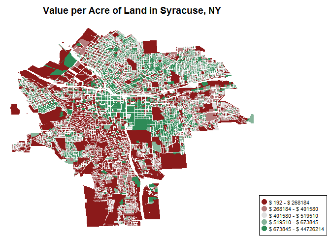
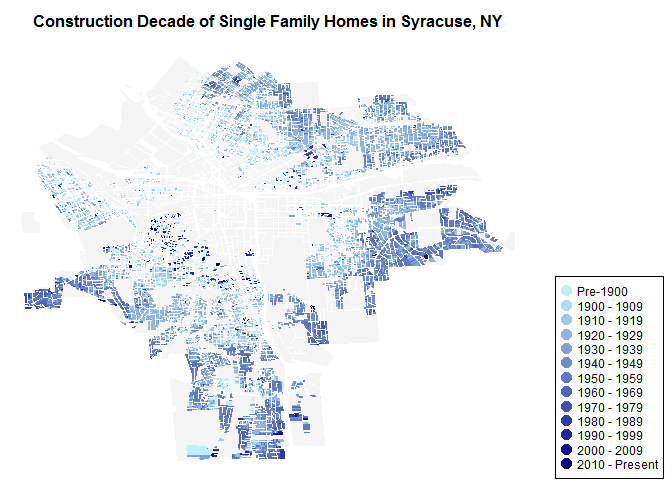

Lab 4 DDMII
================
Christine Brown
February 15, 2017

``` r
setwd("C:/Users/brown/Documents/Grad School/Fall 16/DDMII/lab4")
library( maptools )
library( sp )
library( devtools )
library( dplyr )
library( DT )
library( pander )
syr <- readShapePoly( fn="01-05-2015", proj4string=CRS("+proj=longlat +datum=WGS84") )
syr.df <- as.data.frame( syr )
```

### Question 1: How many single family homes are in each neighborhood?

*Create a table of the count of single family homes by neighborhood*

``` r
table( syr$Nhood[ syr$LandUse == "Single Family" ] )
```

    ## 
    ##                Brighton          Court-Woodlawn                Downtown 
    ##                    1398                    1859                       1 
    ##                Eastwood                 Elmwood            Far Westside 
    ##                    3605                     909                     471 
    ##         Franklin Square            Hawley-Green               Lakefront 
    ##                       0                      52                      24 
    ##            Lincoln Hill             Meadowbrook           Near Eastside 
    ##                     580                    1721                      93 
    ##           Near Westside            North Valley               Northside 
    ##                     521                    1194                    1508 
    ##          Outer Comstock               Park Ave.           Prospect Hill 
    ##                     697                     167                      29 
    ##            Salt Springs                Sedgwick              Skunk City 
    ##                    1029                     892                     345 
    ##            South Campus            South Valley               Southside 
    ##                      25                    1605                     481 
    ##               Southwest              Strathmore               Tipp Hill 
    ##                     419                    1475                     785 
    ##         University Hill University Neighborhood       Washington Square 
    ##                      17                     803                     425 
    ##                Westcott               Winkworth 
    ##                     851                     411

*Highlight all single family homes, using a different color for each neighborhood*

``` r
levels( syr.df$Nhood ) <- c( levels( syr.df$Nhood ),"Not Single Family" )
syr.df$Nhood[ syr.df$LandUse!="Single Family" ] <- "Not Single Family"
col.Nhood <- c( "lightpink", "hotpink", "deeppink", "violetred3", "indianred", "firebrick",
               "darkslategray2", "lightblue3", "dodgerblue", "royalblue2", "deepskyblue4", 
               "lightsalmon1", "darkorange", "chocolate1", "orange3", "orangered2",
               "mediumpurple1", "darkorchid1", "mediumorchid2", "magenta3", "darkmagenta",
               "yellow1", "lightgoldenrod1", "gold", "goldenrod", "darkgoldenrod1",
               "chartreuse2", "darkolivegreen3", "darkseagreen3", "green4", "seagreen4",
               "gray40", "gray94" )
palette( col.Nhood )
par(mar=c(0, 0, 2, 7) + 0.1)
plot( syr, col=syr.df$Nhood, border=F, main="Single Family Homes in Syracuse, NY" )
legend( 'bottomright', legend=levels(syr.df$Nhood), col=palette(),
        pch=19, pt.cex=.8, cex=0.6, xpd=NA, inset=c(-0.24,0))
```



### Question 2: Where does land in Syracuse have the highest value?

*Create a table of the count of single family homes with values above $200k in each neighborhood, as a pecentage of all single family homes*

``` r
SF <- syr.df[ syr.df$LandUse == "Single Family", ]
SF <- mutate( SF, Val200K = ifelse( AssessedVa>200000, "%>$200k", "%<$200k" ) )
round( prop.table( table( SF$Nhood, SF$Val200K ), 1 ) * 100, 2 ) %>% pander()
```

<table style="width:69%;">
<colgroup>
<col width="41%" />
<col width="13%" />
<col width="13%" />
</colgroup>
<thead>
<tr class="header">
<th align="center"> </th>
<th align="center">%&lt;$200k</th>
<th align="center">%&gt;$200k</th>
</tr>
</thead>
<tbody>
<tr class="odd">
<td align="center"><strong>Brighton</strong></td>
<td align="center">100</td>
<td align="center">0</td>
</tr>
<tr class="even">
<td align="center"><strong>Court-Woodlawn</strong></td>
<td align="center">100</td>
<td align="center">0</td>
</tr>
<tr class="odd">
<td align="center"><strong>Downtown</strong></td>
<td align="center">100</td>
<td align="center">0</td>
</tr>
<tr class="even">
<td align="center"><strong>Eastwood</strong></td>
<td align="center">99.97</td>
<td align="center">0.03</td>
</tr>
<tr class="odd">
<td align="center"><strong>Elmwood</strong></td>
<td align="center">100</td>
<td align="center">0</td>
</tr>
<tr class="even">
<td align="center"><strong>Far Westside</strong></td>
<td align="center">100</td>
<td align="center">0</td>
</tr>
<tr class="odd">
<td align="center"><strong>Franklin Square</strong></td>
<td align="center">NA</td>
<td align="center">NA</td>
</tr>
<tr class="even">
<td align="center"><strong>Hawley-Green</strong></td>
<td align="center">100</td>
<td align="center">0</td>
</tr>
<tr class="odd">
<td align="center"><strong>Lakefront</strong></td>
<td align="center">100</td>
<td align="center">0</td>
</tr>
<tr class="even">
<td align="center"><strong>Lincoln Hill</strong></td>
<td align="center">98.79</td>
<td align="center">1.21</td>
</tr>
<tr class="odd">
<td align="center"><strong>Meadowbrook</strong></td>
<td align="center">96.51</td>
<td align="center">3.49</td>
</tr>
<tr class="even">
<td align="center"><strong>Near Eastside</strong></td>
<td align="center">100</td>
<td align="center">0</td>
</tr>
<tr class="odd">
<td align="center"><strong>Near Westside</strong></td>
<td align="center">100</td>
<td align="center">0</td>
</tr>
<tr class="even">
<td align="center"><strong>North Valley</strong></td>
<td align="center">100</td>
<td align="center">0</td>
</tr>
<tr class="odd">
<td align="center"><strong>Northside</strong></td>
<td align="center">99.87</td>
<td align="center">0.13</td>
</tr>
<tr class="even">
<td align="center"><strong>Outer Comstock</strong></td>
<td align="center">99.57</td>
<td align="center">0.43</td>
</tr>
<tr class="odd">
<td align="center"><strong>Park Ave.</strong></td>
<td align="center">100</td>
<td align="center">0</td>
</tr>
<tr class="even">
<td align="center"><strong>Prospect Hill</strong></td>
<td align="center">100</td>
<td align="center">0</td>
</tr>
<tr class="odd">
<td align="center"><strong>Salt Springs</strong></td>
<td align="center">100</td>
<td align="center">0</td>
</tr>
<tr class="even">
<td align="center"><strong>Sedgwick</strong></td>
<td align="center">85.43</td>
<td align="center">14.57</td>
</tr>
<tr class="odd">
<td align="center"><strong>Skunk City</strong></td>
<td align="center">100</td>
<td align="center">0</td>
</tr>
<tr class="even">
<td align="center"><strong>South Campus</strong></td>
<td align="center">100</td>
<td align="center">0</td>
</tr>
<tr class="odd">
<td align="center"><strong>South Valley</strong></td>
<td align="center">99.69</td>
<td align="center">0.31</td>
</tr>
<tr class="even">
<td align="center"><strong>Southside</strong></td>
<td align="center">100</td>
<td align="center">0</td>
</tr>
<tr class="odd">
<td align="center"><strong>Southwest</strong></td>
<td align="center">100</td>
<td align="center">0</td>
</tr>
<tr class="even">
<td align="center"><strong>Strathmore</strong></td>
<td align="center">98.92</td>
<td align="center">1.08</td>
</tr>
<tr class="odd">
<td align="center"><strong>Tipp Hill</strong></td>
<td align="center">100</td>
<td align="center">0</td>
</tr>
<tr class="even">
<td align="center"><strong>University Hill</strong></td>
<td align="center">94.12</td>
<td align="center">5.88</td>
</tr>
<tr class="odd">
<td align="center"><strong>University Neighborhood</strong></td>
<td align="center">97.88</td>
<td align="center">2.12</td>
</tr>
<tr class="even">
<td align="center"><strong>Washington Square</strong></td>
<td align="center">100</td>
<td align="center">0</td>
</tr>
<tr class="odd">
<td align="center"><strong>Westcott</strong></td>
<td align="center">100</td>
<td align="center">0</td>
</tr>
<tr class="even">
<td align="center"><strong>Winkworth</strong></td>
<td align="center">97.32</td>
<td align="center">2.68</td>
</tr>
<tr class="odd">
<td align="center"><strong>Not Single Family</strong></td>
<td align="center">NA</td>
<td align="center">NA</td>
</tr>
</tbody>
</table>

*Plot the value / acre of all parcels in Syracuse*

``` r
syr.df <- mutate( syr.df, ValPerAcre = AssessedVa/Acres )
color.function <- colorRampPalette( c("firebrick4","gray88", "seagreen4" ) )
col.ramp <- color.function( 5 )
color.valperacre <- cut( rank(syr.df$ValPerAcre), breaks=5, labels=col.ramp )
color.valperacre <- as.character( color.valperacre )
par(mar=c(0, 0, 2, 7) + 0.1)
plot(syr, col=color.valperacre, border = F, main="Value per Acre of Land in Syracuse, NY")
breaks <- quantile(syr.df$ValPerAcre,probs = c(0, .2, .4, .6, .8, 1))
legend('bottomright', legend = c(paste("$",round(breaks[1],0),"- $",round(breaks[2],0)),
                              paste("$",round(breaks[2],0),"- $",round(breaks[3],0)),
                              paste("$",round(breaks[3],0),"- $",round(breaks[4],0)),
                              paste("$",round(breaks[4],0),"- $",round(breaks[5],0)),
                              paste("$",round(breaks[5],0),"- $",round(breaks[6],0))),
       col=col.ramp, pch=19, pt.cex=1.5, cex=0.7, xjust=1, xpd=NA, inset=c(-0.24,0))
```



### Question 3: What is the age of single family homes in each neighborhood?

*Create a table that reports the 10th, 25th, 50th, 75th, and 90th percentile of home ages in each neighborhood.*

``` r
SF$YearBuilt <- as.numeric(as.character(SF$YearBuilt))
SF <-  mutate(SF, Age = 2017-SF$YearBuilt)
SF_Grouped <- group_by(SF, Nhood)
summarise( SF_Grouped,
           "10th" = round( quantile( Age, probs = .1, na.rm=TRUE ), 0 ),
           "25th" = round( quantile( Age, probs = .25, na.rm=TRUE ), 0 ),
           "50th" = round( quantile( Age, probs = .5, na.rm=TRUE ), 0 ),
           "75th" = round( quantile( Age, probs = .75, na.rm=TRUE ), 0 ),
           "90th" = round( quantile( Age, probs = .9, na.rm=TRUE ), 0 )) %>% pander
```

<table style="width:82%;">
<colgroup>
<col width="33%" />
<col width="9%" />
<col width="9%" />
<col width="9%" />
<col width="9%" />
<col width="9%" />
</colgroup>
<thead>
<tr class="header">
<th align="center">Nhood</th>
<th align="center">10th</th>
<th align="center">25th</th>
<th align="center">50th</th>
<th align="center">75th</th>
<th align="center">90th</th>
</tr>
</thead>
<tbody>
<tr class="odd">
<td align="center">Brighton</td>
<td align="center">62</td>
<td align="center">87</td>
<td align="center">97</td>
<td align="center">107</td>
<td align="center">117</td>
</tr>
<tr class="even">
<td align="center">Court-Woodlawn</td>
<td align="center">64</td>
<td align="center">74</td>
<td align="center">88</td>
<td align="center">97</td>
<td align="center">117</td>
</tr>
<tr class="odd">
<td align="center">Downtown</td>
<td align="center">89</td>
<td align="center">89</td>
<td align="center">89</td>
<td align="center">89</td>
<td align="center">89</td>
</tr>
<tr class="even">
<td align="center">Eastwood</td>
<td align="center">62</td>
<td align="center">74</td>
<td align="center">87</td>
<td align="center">97</td>
<td align="center">102</td>
</tr>
<tr class="odd">
<td align="center">Elmwood</td>
<td align="center">61</td>
<td align="center">82</td>
<td align="center">89</td>
<td align="center">97</td>
<td align="center">117</td>
</tr>
<tr class="even">
<td align="center">Far Westside</td>
<td align="center">87</td>
<td align="center">97</td>
<td align="center">107</td>
<td align="center">117</td>
<td align="center">127</td>
</tr>
<tr class="odd">
<td align="center">Hawley-Green</td>
<td align="center">88</td>
<td align="center">107</td>
<td align="center">117</td>
<td align="center">127</td>
<td align="center">146</td>
</tr>
<tr class="even">
<td align="center">Lakefront</td>
<td align="center">89</td>
<td align="center">97</td>
<td align="center">112</td>
<td align="center">127</td>
<td align="center">137</td>
</tr>
<tr class="odd">
<td align="center">Lincoln Hill</td>
<td align="center">32</td>
<td align="center">87</td>
<td align="center">97</td>
<td align="center">117</td>
<td align="center">127</td>
</tr>
<tr class="even">
<td align="center">Meadowbrook</td>
<td align="center">57</td>
<td align="center">62</td>
<td align="center">67</td>
<td align="center">85</td>
<td align="center">91</td>
</tr>
<tr class="odd">
<td align="center">Near Eastside</td>
<td align="center">74</td>
<td align="center">82</td>
<td align="center">97</td>
<td align="center">112</td>
<td align="center">127</td>
</tr>
<tr class="even">
<td align="center">Near Westside</td>
<td align="center">17</td>
<td align="center">28</td>
<td align="center">97</td>
<td align="center">117</td>
<td align="center">136</td>
</tr>
<tr class="odd">
<td align="center">North Valley</td>
<td align="center">57</td>
<td align="center">62</td>
<td align="center">82</td>
<td align="center">92</td>
<td align="center">105</td>
</tr>
<tr class="even">
<td align="center">Northside</td>
<td align="center">87</td>
<td align="center">97</td>
<td align="center">107</td>
<td align="center">117</td>
<td align="center">127</td>
</tr>
<tr class="odd">
<td align="center">Outer Comstock</td>
<td align="center">52</td>
<td align="center">58</td>
<td align="center">67</td>
<td align="center">76</td>
<td align="center">92</td>
</tr>
<tr class="even">
<td align="center">Park Ave.</td>
<td align="center">87</td>
<td align="center">97</td>
<td align="center">107</td>
<td align="center">117</td>
<td align="center">127</td>
</tr>
<tr class="odd">
<td align="center">Prospect Hill</td>
<td align="center">75</td>
<td align="center">87</td>
<td align="center">97</td>
<td align="center">117</td>
<td align="center">130</td>
</tr>
<tr class="even">
<td align="center">Salt Springs</td>
<td align="center">55</td>
<td align="center">62</td>
<td align="center">77</td>
<td align="center">89</td>
<td align="center">97</td>
</tr>
<tr class="odd">
<td align="center">Sedgwick</td>
<td align="center">64</td>
<td align="center">74</td>
<td align="center">87</td>
<td align="center">95</td>
<td align="center">107</td>
</tr>
<tr class="even">
<td align="center">Skunk City</td>
<td align="center">56</td>
<td align="center">87</td>
<td align="center">97</td>
<td align="center">117</td>
<td align="center">127</td>
</tr>
<tr class="odd">
<td align="center">South Campus</td>
<td align="center">31</td>
<td align="center">52</td>
<td align="center">60</td>
<td align="center">71</td>
<td align="center">89</td>
</tr>
<tr class="even">
<td align="center">South Valley</td>
<td align="center">54</td>
<td align="center">62</td>
<td align="center">67</td>
<td align="center">87</td>
<td align="center">97</td>
</tr>
<tr class="odd">
<td align="center">Southside</td>
<td align="center">24</td>
<td align="center">87</td>
<td align="center">97</td>
<td align="center">116</td>
<td align="center">117</td>
</tr>
<tr class="even">
<td align="center">Southwest</td>
<td align="center">16</td>
<td align="center">24</td>
<td align="center">87</td>
<td align="center">107</td>
<td align="center">117</td>
</tr>
<tr class="odd">
<td align="center">Strathmore</td>
<td align="center">61</td>
<td align="center">81</td>
<td align="center">91</td>
<td align="center">97</td>
<td align="center">109</td>
</tr>
<tr class="even">
<td align="center">Tipp Hill</td>
<td align="center">78</td>
<td align="center">92</td>
<td align="center">107</td>
<td align="center">117</td>
<td align="center">127</td>
</tr>
<tr class="odd">
<td align="center">University Hill</td>
<td align="center">73</td>
<td align="center">87</td>
<td align="center">97</td>
<td align="center">107</td>
<td align="center">114</td>
</tr>
<tr class="even">
<td align="center">University Neighborhood</td>
<td align="center">65</td>
<td align="center">71</td>
<td align="center">89</td>
<td align="center">97</td>
<td align="center">107</td>
</tr>
<tr class="odd">
<td align="center">Washington Square</td>
<td align="center">87</td>
<td align="center">97</td>
<td align="center">117</td>
<td align="center">137</td>
<td align="center">157</td>
</tr>
<tr class="even">
<td align="center">Westcott</td>
<td align="center">62</td>
<td align="center">82</td>
<td align="center">92</td>
<td align="center">100</td>
<td align="center">117</td>
</tr>
<tr class="odd">
<td align="center">Winkworth</td>
<td align="center">46</td>
<td align="center">57</td>
<td align="center">62</td>
<td align="center">69</td>
<td align="center">87</td>
</tr>
</tbody>
</table>

*Create a choropleth map that shows the age of properties by decade, pre-1900s can be one category.*

``` r
color.function.decade <- colorRampPalette( c( "lightblue1", "darkblue" ) )
col.ramp.decade <- color.function.decade( 13 )
color.decade <- cut( as.numeric( as.character( SF$YearBuilt ) ) , breaks = c( 1700 , seq( 1900, 2020, 10 ) ), labels=col.ramp.decade )
color.decade <- as.character( color.decade )
par( mar = c( 0, 0, 2, 7) + 0.1)
plot( syr[ syr$LandUse!="Single Family", ], border=FALSE, col="gray96",
      main="Construction Decade of Single Family Homes in Syracuse, NY", cex.main=1)
plot( syr[ syr$LandUse=="Single Family", ], border=FALSE, col=color.decade, add=TRUE)
legend( 'bottomright', legend = c("Pre-1900", "1900 - 1909", "1910 - 1919", "1920 - 1929",
                                 "1930 - 1939", "1940 - 1949", "1950 - 1959", "1960 - 1969", 
                                 "1970 - 1979", "1980 - 1989", "1990 - 1999", "2000 - 2009",
                                 "2010 - Present"),
       col=col.ramp.decade, pch=19, pt.cex=1.5, cex=0.75, xjust=1, xpd=NA, inset=c( -0.24,0 ) )
```


