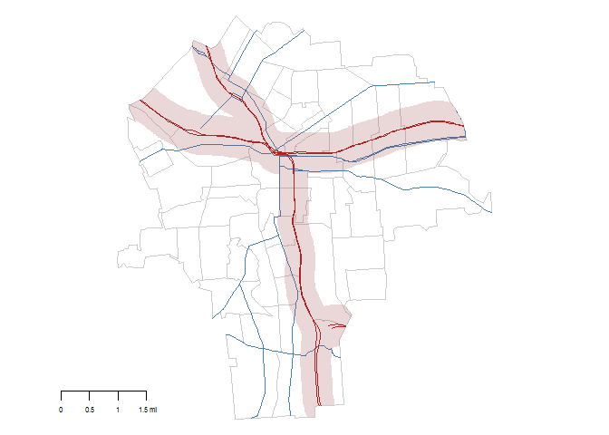

20170309-Lab06-DDMII
================
Christine Brown
March 9, 2017

Part 1: (1) Download the Tiger shapefiles for Onondaga County census tracts and primary and secondary roads (see attached). Plot both together, highlighting interstates. (2) Clip the roads shapefile so that it is the same size as the census tracts shapefile. (3) Extract the interstates as a separate layer (subset function). (4) Create a buffer of approximately a quarter mile (eyeball this) from the interstate, and identify all houses that fall within this zone. (5) Add a new categorical variable to the houses dataset that indicates whether it falls within the buffer zone or not.

Part 2: Using the Syracuse parcel file: (1) Create a buffer a quarter mile from industrial zones (LandUse). Create a plot to highlight your buffer zone. (2) Identify houses within the buffer zone and create a categorical variable in the dataset indicating proximity to industrial zones. (3) Create a buffer zone an eighth of a mile from schools. Create a plot go highlight these buffer zones. (4) Identify houses within the buffer zone and create a categorical variable in the dataset indicating proximity to schools.

``` r
#Load Packages
library( maps )
library( maptools )
library( raster )
library( rgeos )
library( sp )

#Prepare Working Directory
setwd("C:/Users/brown/Documents/Grad School/Fall 16/DDMII/all-labs-ddmii-christine-brown/Lab06")
#dir.create( "shapefiles" )
setwd( "./shapefiles" )

#Download Onondaga Data
##download.file("ftp://ftp2.census.gov/geo/tiger/TIGER2010/TRACT/2010/tl_2010_36067_tract10.zip", "onondaga_census_tracts.zip" )
##unzip( "onondaga_census_tracts.zip" )
##file.remove( "onondaga_census_tracts.zip" )

#Load Onondaga Data in Environment
ono_tracts <- readShapePoly( fn="tl_2010_36067_tract10", proj4string=CRS("+proj=longlat +datum=WGS84") )
syr <- ono_tracts[as.numeric(as.character(ono_tracts$NAME10)) < 62, ]

#Download Road Data
##download.file("ftp://ftp2.census.gov/geo/tiger/TIGER2015/PRISECROADS/tl_2015_36_prisecroads.zip", "roads.zip" )
##unzip( "roads.zip" )
##file.remove( "roads.zip" )

#Load Road Data in Environment
roads <- readShapeLines( fn="tl_2015_36_prisecroads", proj4string=CRS("+proj=longlat +datum=WGS84") )

#Subset Interstates
interstate <- roads[ roads$RTTYP == "I" , ]
noninterstate <- roads[ roads$RTTYP != "I" , ]

#Clip Roads
interstate_clipped <- gIntersection(syr, interstate, byid = TRUE, drop_lower_td = TRUE) #clip interstate with syr
noninterstate_clipped <- gIntersection(syr, noninterstate, byid = TRUE, drop_lower_td = TRUE) #clip noninterstate with syr

#Plot Tracts and Roads
par( mar=c(0,0,0,0) )
plot(syr, border="gray80")
plot(noninterstate_clipped, col = "steelblue", lwd=1.25, add=T)
plot(interstate_clipped, col = "firebrick", lwd=1.75, add=T)

#Add Scale
map.scale( metric=F, ratio=F, relwidth = 0.1, cex=.5 )

#Create Buffer
buff1 <- gBuffer( interstate_clipped, width=.005, byid=T )
buff1 <- gUnaryUnion( buff1, id = NULL )
buff1_clipped <- gIntersection(syr, buff1)
plot(buff1_clipped, col=rgb(150,50,50,50,maxColorValue=255),add=T, border=F)
```


