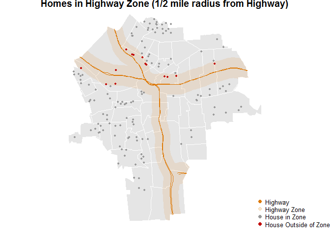
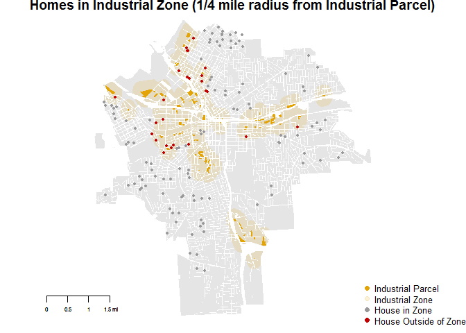
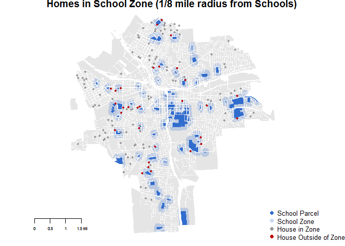

20170309-Lab06-DDMII
================
Christine Brown
March 9, 2017

Set-Up

``` r
#Load Packages
library( dplyr )
library( geojsonio )
library( maps )
library( maptools )
library( raster )
library( rgdal )
library( rgeos )
library( sp )

#Prepare Working Directory
setwd("C:/Users/brown/Documents/Grad School/Fall 16/DDMII/all-labs-ddmii-christine-brown/Lab06")
```

Part I

``` r
#Download Onondaga Data
##download.file("ftp://ftp2.census.gov/geo/tiger/TIGER2010/TRACT/2010/tl_2010_36067_tract10.zip", "onondaga_census_tracts.zip" )
##unzip( "onondaga_census_tracts.zip" )
##file.remove( "onondaga_census_tracts.zip" )

#Load Onondaga Data in Environment
ono_tracts <- readShapePoly( fn="tl_2010_36067_tract10", proj4string=CRS("+proj=longlat +datum=WGS84") )
syr <- ono_tracts[as.numeric(as.character(ono_tracts$NAME10)) < 62, ]

#Download Road Data
##download.file("ftp://ftp2.census.gov/geo/tiger/TIGER2015/PRISECROADS/tl_2015_36_prisecroads.zip", "roads.zip" )
##unzip( "roads.zip" )
##file.remove( "roads.zip" )

#Load Road Data in Environment
roads <- readShapeLines( fn="tl_2015_36_prisecroads", proj4string=CRS("+proj=longlat +datum=WGS84") )

#Subset Interstates
interstate <- roads[ roads$RTTYP == "I" , ]

#Clip Roads
interstate_clipped <- gIntersection(syr, interstate, byid = TRUE, drop_lower_td = TRUE) #clip interstate with syr

#Create Buffer
buff1 <- gBuffer( interstate_clipped, width=.005, byid=T )
buff1 <- gUnaryUnion( buff1, id = NULL )
buff1_clipped <- gIntersection(syr, buff1)
```

``` r
#Load Houses
houses <- read.csv("https://raw.githubusercontent.com/R-Class/all-labs-ddmii-christine-brown/master/Lab05/houses.census.crime.csv")
coordinates <- read.csv("https://raw.githubusercontent.com/R-Class/all-labs-ddmii-christine-brown/master/Lab05/coordinates.csv")
coordinates_SP <- SpatialPoints(coordinates, proj4string=CRS("+proj=longlat +datum=WGS84") )
highway.zone <- over(coordinates_SP, buff1_clipped )
highway.zone[is.na(highway.zone)] <- 0
highway.zone <- as.data.frame(highway.zone)
houses <- cbind(houses, highway.zone)

#Plot Tracts, Roads, Buffer, and Houses
par( mar=c(.6,0,.6,0) )
plot(syr, col="gray90", border="white", main="Homes in Highway Zone (1/2 mile radius from Highway)")
plot(interstate_clipped, col = "#dd7804", lwd=1.75, add=T)
plot(buff1_clipped, col=rgb(221, 120, 4,30,maxColorValue=255),add=T, border=F)
points(coordinates_SP[houses$highway.zone==0], pch=20, cex=.9, col="gray60")
points(coordinates_SP[houses$highway.zone==1], col="#c10101", pch=20, cex=.9)

#Add Legend
legend( 'bottomright', pch=20, pt.cex=1.4, cex=.8, xpd=NA, bty="n", inset=-.01,
        legend=c("Highway", "Highway Zone", "House in Zone", "House Outside of Zone"), 
        col=c("#dd7804",rgb( 221, 120, 4,50, maxColorValue=255), "gray60", "#c10101"))
#Add Scale
map.scale( metric=F, ratio=F, relwidth = 0.1, cex=.5, y=-2, x=0 )
```



Part II

``` r
#load shapefiles
##download.file("https://raw.githubusercontent.com/lecy/geojson/master/syr_parcels.geojson", "syr_parcels.geojson" )
syr_parcels <- readOGR(dsn = "syr_parcels.geojson")
```

    ## OGR data source with driver: GeoJSON 
    ## Source: "syr_parcels.geojson", layer: "OGRGeoJSON"
    ## with 41502 features
    ## It has 64 fields

``` r
#identify industrial parcels
industrial <- syr_parcels[syr_parcels$LandUse == "Industrial",]

#create industrial buffer
buff2 <- gBuffer( industrial, width=.0035, byid=F )
buff2_clipped <- gIntersection(syr_parcels, buff2)
buff2_clipped_proj <- spTransform( buff2_clipped, CRS( "+proj=longlat +datum=WGS84" ) )

#find data in buffer zone and record in dataframe
industrial.zone <- over(coordinates_SP, buff2_clipped_proj )
industrial.zone[is.na(industrial.zone)] <- 0
industrial.zone <- as.data.frame(industrial.zone)
houses <- cbind(houses, industrial.zone)

#plot industrial zone map with data
par( mar=c(.4,0,.6,0) )
plot(syr_parcels, border=F, col="gray90", main="Homes in Industrial Zone (1/4 mile radius from Industrial Parcel)" )
plot(industrial, border=F, col="#e2a409", add=T)
plot(buff2_clipped, col=rgb( 226, 164, 9, 40, maxColorValue=255), border=F, add=T)
map.scale( metric=F, ratio=F, relwidth = 0.1, cex=.5 )
points(coordinates_SP[houses$industrial.zone==0], col="gray60", pch=20, cex=.9)
points(coordinates_SP[houses$industrial.zone==1], col="#c10101", pch=20, cex=.9)

#Add Legend
legend( 'bottomright', pch=20, pt.cex=1.4, cex=.8, xpd=NA, bty="n", inset=-.01, 
        legend=c("Industrial Parcel", "Industrial Zone", "House in Zone", "House Outside of Zone"), 
        col=c("#e2a409",rgb( 226, 164, 9, 40, maxColorValue=255), "gray60", "#c10101"))
map.scale( metric=F, ratio=F, relwidth = 0.1, cex=.5 )
```



``` r
#identify school parcels
school <- syr_parcels[syr_parcels$LandUse == "Schools",]

#create school buffer
buff3 <- gBuffer( school, width=.0018, byid=F )
buff3_clipped <- gIntersection(syr_parcels, buff3)
buff3_clipped_proj <- spTransform( buff3_clipped, CRS( "+proj=longlat +datum=WGS84" ) )

#find data in school buffer zone and record in dataframe
school.zone <- over(coordinates_SP, buff3_clipped_proj )
school.zone[is.na(school.zone)] <- 0
school.zone <- as.data.frame(school.zone)
houses <- cbind(houses, school.zone)

#plot school zone map with data
par( mar=c(.4,0,.6,0) )
plot(syr_parcels, border=F, col="gray90", main="Homes in School Zone (1/8 mile radius from Schools)" )
plot(school, border=F, col="#316dce", add=T)
plot(buff3_clipped, col=rgb( 49, 109, 206, 60, maxColorValue=255), border=F, add=T)
map.scale( metric=F, ratio=F, relwidth = 0.1, cex=.5 )
points(coordinates_SP[houses$school.zone==0], col="gray60", pch=20, cex=.9)
points(coordinates_SP[houses$school.zone==1], col="#c10101", pch=20, cex=.9)

#Add Legend
legend( 'bottomright', pch=20, pt.cex=1.4, cex=.8, xpd=NA, bty="n", inset=-.01,
        legend=c("School Parcel", "School Zone", "House in Zone", "House Outside of Zone"), 
        col=c("#316dce",rgb( 49, 109, 206, 60, maxColorValue=255), "gray60", "#c10101"))
map.scale( metric=F, ratio=F, relwidth = 0.1, cex=.5 )
```


